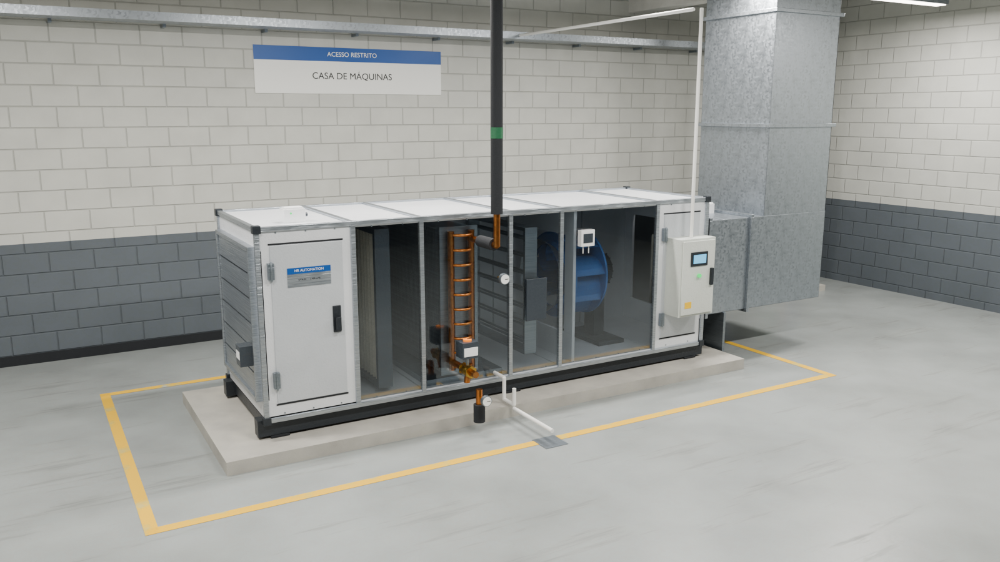

# HR Automation — site

Landing page da **HR Automation**, automação industrial para HVAC.



## O que tem aqui

- **Site estático** (`index.html`, `css/`, `js/`) — sem build, sem dependências locais.
- **UTA 3D + IHM** — uma unidade de tratamento de ar modelada no Blender, numa casa de
  máquinas, simulada em tempo real (malha PI da válvula, ventilador EC em controle de vazão,
  resistência, umidade e alarmes) e operada por um terminal **pGD1** fiel a um programa real
  de fancoil. Ao abrir o setpoint de temperatura, a válvula ou o ventilador na IHM, a câmera
  vai até o componente.
  - `js/script.js` — simulação (`window.hrLive`)
  - `js/pgd.js` — terminal pGD1 (LCD 132×64 desenhado pixel a pixel)
  - `js/uta3d.js` — visualizador three.js (Draco + WebP, bake de iluminação, GTAO)
- **Marcas** — logos oficiais em `img/marcas/` com resumo ao clicar (`js/brands.js`).
- `ihm/` — versão experimental do site inteiro como uma IHM touch.

## Rodar localmente

```bash
python -m http.server 5500
```

e abra <http://localhost:5500>.

## Recriar o modelo 3D

Requer Blender 5.1+ (o bake usa Cycles; com GPU NVIDIA leva ~3 min).

```bash
blender -b --python 3d/build_uta.py            # modelagem + texturas + bake + export
blender -b 3d/uta.blend --python 3d/export_web.py   # só reexportar o .glb otimizado
```

Saídas: `models/uta.glb`, `models/room_env.hdr` e `3d/render.png`.
As texturas são procedurais (geradas por código em `3d/texgen.py`).

## Créditos

Logos das marcas pertencem aos respectivos fabricantes e são usados apenas para
identificar os equipamentos que a HR Automation integra. As imagens de logos vêm do
Wikimedia Commons / Wikipédia.
